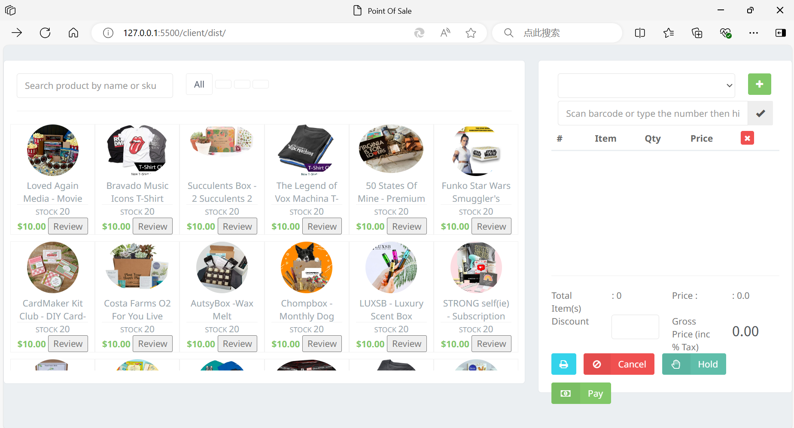
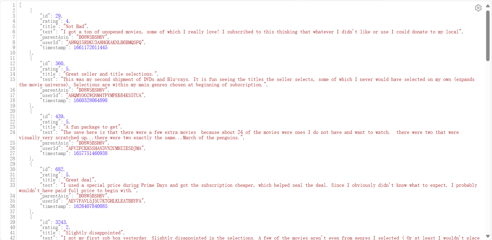
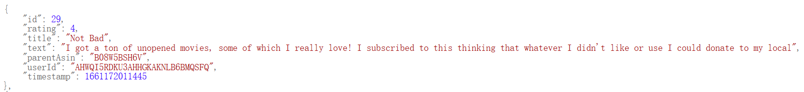

# aw07

## 选取的数据：
1. Subscritpion_Boxes的元数据和评论数据（分别为batch-processing/src/main/resources目录下的meta_Subscription_Boxes.jsonl和Subscriptions_Boxes.jsonl）
2. Magazine_Subscriptions的元数据和评论数据（分别为batch-processing/src/main/resources目录下的meta_Magazine_Subscriptions.jsonl和Magazine_Subscriptions.jsonl）

总共两大类商品的元数据和评论数据。

## 所做的处理步骤：
- 使用spring batch对原始格式的数据进行了处理，相关代码在batch-processing目录下。数据处理后得到的数据库在batch-processing/data目录下，其它微服务均使用该数据库。

- 定义了User/Product/Review三类对象，在batch-processing/src/main/java/com/example/bachprocessing/model目录下。其中User和Review对象由商品的评论数据得到，Product对象由商品的元数据得到。Product和Review对象之间通过parent_asin值建立关联关系，即每一个Review对象属于与其具有相同parent_asin的Product对象。

- 在batch-processing/src/main/java/com/example/bachprocessing/processor目录下定义了ProductItemProcessor、ReviewItemProcessor和UserItemProcessor三个类。这三个类都实现了ItemProcessor接口。其中，ReviewItemProcessor对Review类型的对象进行了一些复杂的处理：
对于Review类型的对象中的text属性（对应的是评论数据中每一个记录的"text"的内容），我对其字符串值进行了摘要。我通过调用本地的模型实现字符串摘要，调用的模型信息见链接：https://huggingface.co/Falconsai/text_summarization
具体的方法是：写一个python文件用于调用模型，并对调用该python文件的命令行参数中的一个字符串（即text属性的值）进行摘要，详细细节可见batch-processing/summarize.py，该文件中的代码为：
```python
import sys
from transformers import pipeline
summarizer = pipeline("summarization",model="Falconsai/text_summarization")
result = summarizer(sys.argv[1],max_length = 40,min_length = 0,do_sample = False)[0]
print(result['summary_text'])
```

编写python文件后，在ReviewItemProcessor中通过以下的java代码，将要进行摘要的字符串（即text属性的值）作为命令行参数来调用该python文件，由此完成对字符串的摘要：
```java
private String summarize(String reviewText) {

    try {
        String s = null;
        StringBuilder output = new StringBuilder();
        String[] cmd = new String[3];
        cmd[0] = "python";
        cmd[1] = "summarize.py";
        cmd[2] = reviewText;
        Process p = Runtime.getRuntime().exec(cmd);
        BufferedReader in = new BufferedReader(new InputStreamReader(p.getInputStream(),"UTF-8"));
        while ((s = in.readLine()) != null) {
            output.append(s);
        }
        return output.toString();
    } catch (Exception e) {
        e.printStackTrace();
        return null;
    }
}
```

我还另外尝试了对Review类型的对象中的text字符串通过调用本地模型进行翻译，调用的模型见链接：https://huggingface.co/Helsinki-NLP/opus-mt-en-zh 
python代码见batch-processing/translate.py，对应的java代码见ReviewItemProcessor中的translateToZh函数。但得到的中文字符串中出现了乱码，所以最终没有进行翻译的处理。

- 在batch-processing/src/main/java/com/example/bachprocessing/repository目录下定义了ProductRepostiory、ReviewRepository和UserRepository三个类，分别用于Product、Review和User三个类的对象的数据库存储，其中，数据库使用的是h2数据库。

- 在batch-processing/src/main/java/com/example/bachprocessing/mapper目录下定义了ProductJsonLineMapper、ReviewJsonLineMapper和UserJsonLineMapper三个类。这三个类都实现了LineMapper接口，用于对jsonl格式的文件数据进行解析，并生成相应的对象。例如，ReviewLineMapper类的实现为：
```java
public class ReviewJsonLineMapper implements LineMapper<Review>{
    
    private JsonLineMapper jsonLineMapper = new JsonLineMapper();

    @Override
    public Review mapLine(String line,int lineNumber) throws Exception{
        Review review = new Review();
        Map<String,Object> reviewMap = jsonLineMapper.mapLine(line, lineNumber);
        review.setRating((Double)reviewMap.get("rating"));
        review.setTitle((String)reviewMap.get("title"));
        review.setText((String)reviewMap.get("text"));
        review.setParentAsin((String)reviewMap.get("parent_asin"));
        review.setUserId((String)reviewMap.get("user_id"));
        review.setTimestamp((Long)reviewMap.get("timestamp"));
        return review;
    }
}
```

- 在batch-processing/src/main/java/com/example/bachprocessing/writer目录下定义了ProductWriter、ReviewWriter和UserWriter三个类，分别用于将Product、Review和User三个类的对象存入对应的repository中，即存到数据库中。

- batch-processing/src/main/java/com/example/bachprocessing/configuration目录下定义了一个BatchConfiguration类，用于对spring batch进行配置。该类中定义了一个Job和六个step，Job依次执行这六个step。同时该类中还定义了和User/Product/Review这三类对象相对应的FlatFileItemReader，每个reader的lineMapper设置为前述对应的ProductJsonLineMapper/ReviewJsonLineMapper/UserJsonLineMapper类型的对象。

## 处理结果
部分商品列表截图（前端使用的是client目录下的文件）：



点击Review按钮能看到对商品的评论：



其中一条评论为：



而原始的text数据值为：
```
"text": "The second box I received was better than the first box. In the first box, I actually got a Blu-Ray and DVD of the same movie. In this box, however, I got a ton of unopened movies, some of which I really love! I subscribed to this thinking that whatever I didn't like or use I could donate to my local library, who then re-sells them and the proceeds go toward supporting the library. So, it's a win either way. And for the ones I want to see before I donate them, paying $30 a month for 25 movies, even if I only watch them once, is a fantastic price compared to seeing one movie at prime time in the theater. Plus, I get to re-home media that might otherwise go to the landfill. What a great idea!"
```
可以看到，spring-batch对text的字符串值进行了摘要。