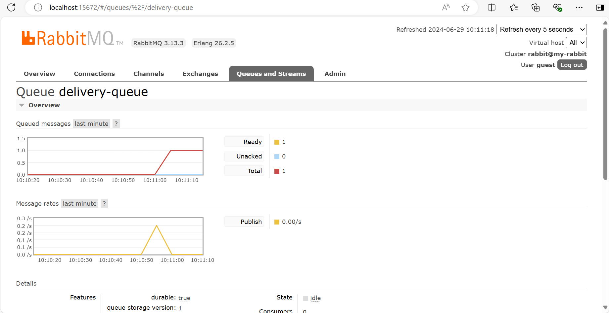
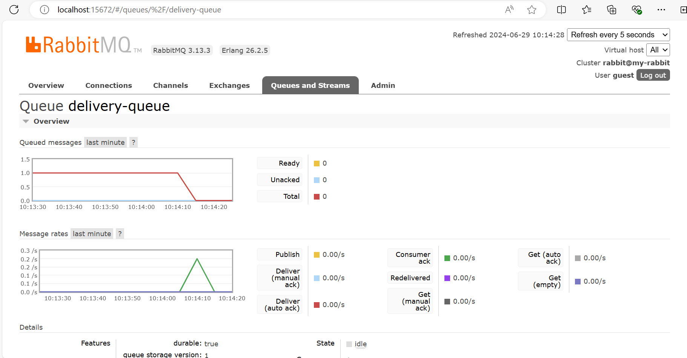
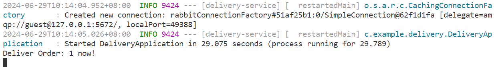

# aw08

## 实现方式

- 使用RabbitMQ实现的消息队列。

- webpos-orders/src/main/java/com/example/orders/configuration目录下的OrderServiceConfiguration类中配置了Exchange、Queue和Binding，以及MessageConverter用于将发送的OrderDto类型的对象消息进行JSON序列化。

- webpos-orders/src/main/java/com/example/orders/rest目录下的OrderRestController类中注入了一个RabbitTemplate类型的对象。当产生订单时，调用RabbitTemplate的convertAndSend函数将OrderDto类型的对象放到消息队列中（具体可见OrderRestController类中的processOrderDelivery函数）。

- 实现了一个运送服务（delivery service），代码在delivery-service目录下。在delivery-service/src/main/java/com/example/delivery/configuration目录下的DeliveryServiceConfiguration类中配置了消息队列的名称，用于设置从哪个队列接收消息。除此之外，还配置了一个MessageConverter类型的Bean，用于将收到的消息JSON反序列化为OrderDto类型的对象。

- delivery-service/src/main/java/com/example/delivery/service目录下的DeliveryServiceImp类添加了@RabbitListener注释，消息队列的名称为前述DeliveryServiceConfiguration类中配置的队列的名称。同时，在DeliveryServiceImp类中实现了一个deliver函数，该函数上添加了@RabbitHandler注释，用于对接收到的消息进行处理，即存储并运送订单（运送订单目前的实现是简单地在控制台输出订单id）。

## 实验验证

通过以下命令启动RabbitMQ：
```
docker run -d --hostname my-rabbit --name some-rabbit -p 15672:15672 -p 5672:5672 rabbitmq:3-management
```

当产生一个订单时，队列中的变化为下图所示：



启动delivery-service之后，队列中的变化为下图所示：



同时delivery-service的控制台输出为：



可以看到，在控制台输出了```Deliver Order: 1 now!```，其中1为Order的id。说明delivery-service接收到了消息，并对消息进行了处理。
